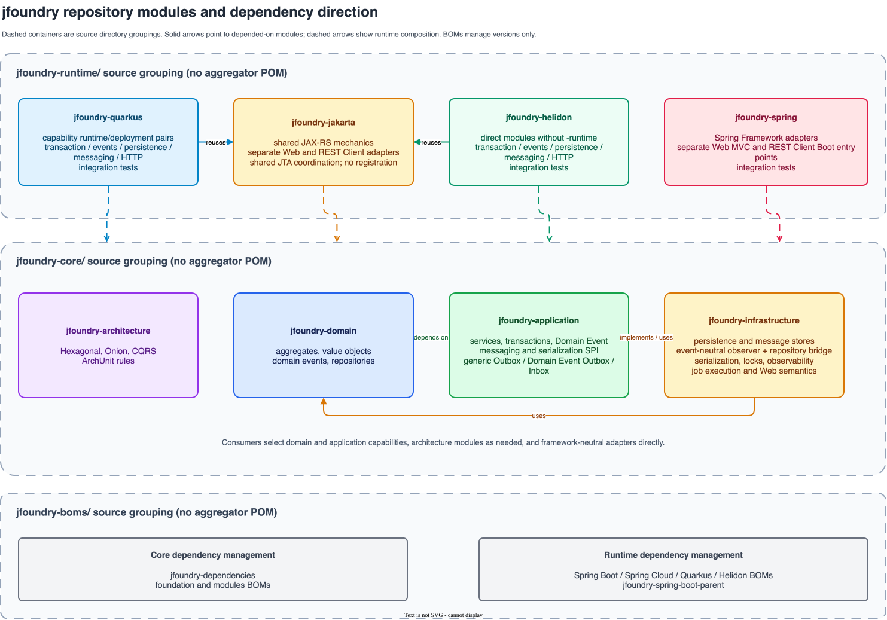

# jfoundry

中文 | [English](README.md)

---

`jfoundry` 是一个面向 Java 的可落地 DDD 开发框架，基于 jMolecules 构建，适用于 Hexagonal Architecture（六边形架构）和 Onion Architecture（洋葱架构）。

它让业务项目能将领域建模、架构边界和可靠集成落实为代码。核心定义 DDD 概念、架构语义、应用层契约、领域事件、持久化 SPI 和消息 SPI，不依赖特定运行时框架。Spring、Quarkus 与 Helidon 通过平级运行时集成模块装配同一套核心能力。

## 为什么是 jfoundry

很多 DDD 项目会在实现中失去原有边界：领域代码引入框架或 ORM API，事务归属不清，Repository 演变为通用查询接口，外部事件也无法可靠投递。`jfoundry` 提供：

- 基于 jMolecules 的 DDD、Hexagonal、Onion 和 CQRS 语义。
- 领域、应用、基础设施与运行时集成之间明确的依赖方向。
- 将架构约束变为可执行测试的 ArchUnit 规则。
- 用于持久化、消息传输、可靠消息、事务和运行时装配的可选生产能力。

## 架构

领域模型不依赖 Spring、ORM、HTTP、消息代理或数据库客户端。应用层契约编排用例并定义能力 SPI；基础设施实现技术适配器；运行时集成负责装配。

```text
运行时集成
  -> 应用层 / 基础设施适配器
       -> 应用层契约
            -> 领域
```

依赖方向始终指向内层。因此运行时集成位于核心之外，而不是每个应用的必需依赖。



## AI 辅助架构工作流

[`domain-architecture-skills`](https://github.com/xfoundries/domain-architecture-skills) 是
JFoundry 在设计期的配套插件。它帮助 AI 编程代理从需求出发完成领域建模和架构决策，仅当项目选择 JFoundry 后才进入框架落地。它需要独立安装，不是运行时依赖，也不要求采用某种固定的组合架构。

```text
需求 -> 领域建模 -> 架构决策 -> 可选的 jfoundry 落地 -> 实施交接
```

## 能力概览

| 范畴 | 能力 |
|------|------|
| 领域建模 | 聚合、值对象、领域事件、Repository 契约和领域异常 |
| 架构 | Hexagonal 和 Onion 语义，以及 ArchUnit 规则 |
| 应用层 | 应用服务、事务边界、CQRS 和领域事件编排 |
| 持久化 | 聚合持久化契约，以及 MyBatis-Plus 和 JPA 实现 |
| 消息传输 | 运行时无关的出站传输契约，以及显式选择的 Kafka、RabbitMQ、RocketMQ 适配器 |
| 可靠消息 | Transactional Outbox、Inbox 幂等、消息和序列化 SPI |
| 运行时集成 | Spring Framework 与 Spring Boot 装配；Quarkus 与 Helidon 的 CDI/Jakarta Transactions、JPA、Outbox/Inbox 与 REST Problem Details 装配 |

## 选择路径

- **架构与建模**：从[接入指南](docs/i18n/zh/integration/getting-started.md)开始，选择[架构风格](docs/i18n/zh/framework/architecture-styles.md)，并阅读[建模约定](docs/i18n/zh/modeling/repository-vs-read-contracts.md)。
- **聚合持久化**：先阅读[聚合持久化](docs/i18n/zh/capabilities/aggregate-persistence.md)，再选择适合项目的平级实现：[MyBatis-Plus](docs/i18n/zh/implementations/mybatis-plus.md) 或 [JPA](docs/i18n/zh/implementations/jpa.md)。
- **消息传输**：通过[消息传输](docs/i18n/zh/capabilities/message-delivery.md)选择直接使用的 Kafka、RabbitMQ、RocketMQ 或应用自有传输适配器。
- **Spring Boot + MyBatis-Plus（常用组合）**：先完成 [Spring Boot 运行时装配](docs/i18n/zh/implementations/spring-boot.md)，再接入 [MyBatis-Plus](docs/i18n/zh/implementations/mybatis-plus.md) 聚合持久化；这是一条常见接入路径，不改变 JPA 的同等支持地位。
- **可靠消息**：先阅读[可靠消息](docs/i18n/zh/capabilities/reliable-messaging.md)，再从对应的 [MyBatis-Plus](docs/i18n/zh/implementations/mybatis-plus.md) 或 [JPA](docs/i18n/zh/implementations/jpa.md) 指南中选择其存储实现。
- **Spring Boot**：通过 [Spring Boot 运行时装配](docs/i18n/zh/implementations/spring-boot.md) 使用启动器与条件化自动配置组装已选择的能力；其属性、条件与 Bean 优先级见 [Spring Boot 自动配置参考](docs/i18n/zh/reference/spring-boot-autoconfiguration.md)。
- **Quarkus**：通过 [Quarkus 运行时集成](docs/i18n/zh/implementations/quarkus.md) 使用显式扩展组合接入 CDI 事务、REST Problem Details、领域事件分发、基于 JPA 的可靠消息、Kafka 与 RabbitMQ 投递并验证原生镜像。
- **Helidon MP**：通过 [Helidon MP 运行时集成](docs/i18n/zh/implementations/helidon.md) 显式组合 CDI/JTA、JPA、Outbox/Inbox 与 REST Problem Details。其原生镜像当前验证 CDI/Web；Helidon Narayana JTA 的原生执行仍是上游实验性能力。

## 最小接入

所有应用都引入运行时无关 BOM，再只添加应用需要的启动器与能力实现。Spring Boot、Quarkus 与 Helidon 应用还要额外引入各自的运行时 BOM；运行时 BOM 只管理平台生态版本，不能替代 JFoundry BOM。

```xml
<dependencyManagement>
    <dependencies>
        <dependency>
            <groupId>io.github.xfoundries</groupId>
            <artifactId>jfoundry-dependencies</artifactId>
            <version>${jfoundry.version}</version>
            <type>pom</type>
            <scope>import</scope>
        </dependency>
    </dependencies>
</dependencyManagement>
```

## 领域模型示例

```java
// Money.java
import org.jfoundry.domain.valueobject.ValueObject;

import java.math.BigDecimal;

public record Money(BigDecimal amount, String currency) implements ValueObject {
}
```

```java
// OrderId.java
import org.jmolecules.ddd.types.Identifier;

public record OrderId(String value) implements Identifier {
}
```

```java
// Order.java
import org.jfoundry.domain.entity.agg.BaseAggregateRoot;

public final class Order extends BaseAggregateRoot<Order, OrderId> {

    private Money total;

    public Order(OrderId id, Money total) {
        super(id);
        this.total = total;
    }

    public void changeTotal(Money total) {
        this.total = total;
    }
}
```

## 文档

### 快速开始

- [接入指南](docs/i18n/zh/integration/getting-started.md)
- [采用就绪度与已验证范围](docs/i18n/zh/integration/adoption-readiness.md)
- [`domain-architecture-skills`](https://github.com/xfoundries/domain-architecture-skills)

### 能力

- [聚合持久化](docs/i18n/zh/capabilities/aggregate-persistence.md)
- [消息传输](docs/i18n/zh/capabilities/message-delivery.md)
- [可靠消息：Outbox 与 Inbox](docs/i18n/zh/capabilities/reliable-messaging.md)
- [应用事务](docs/i18n/zh/capabilities/application-transactions.md)
- [分布式锁](docs/i18n/zh/capabilities/distributed-locks.md)

### 持久化实现

- [MyBatis-Plus](docs/i18n/zh/implementations/mybatis-plus.md)
- [JPA](docs/i18n/zh/implementations/jpa.md)

### 运行时集成

- [Spring Boot 运行时装配](docs/i18n/zh/implementations/spring-boot.md)
- [Quarkus 运行时集成](docs/i18n/zh/implementations/quarkus.md)
- [Helidon MP 运行时集成](docs/i18n/zh/implementations/helidon.md)

### 框架语义

- [架构风格指南](docs/i18n/zh/framework/architecture-styles.md)
- [ArchUnit 架构规则](docs/i18n/zh/framework/archunit-rules.md)
- [框架边界设计](docs/i18n/zh/framework/framework-boundaries.md)

### 建模

- [值对象规范](docs/i18n/zh/modeling/value-object.md)
- [Repository 与读侧契约迁移指南](docs/i18n/zh/modeling/repository-vs-read-contracts.md)

### 发布与兼容

- [兼容性矩阵](docs/release/compatibility.md)
- [发布到 Maven Central](docs/release/maven-central.md)
- [原生镜像验证状态](docs/i18n/zh/integration/adoption-readiness.md)：应结合[兼容性矩阵](docs/release/compatibility.md)查看已按运行时与能力划定的验证证据，不能据此推定所有组件均受支持。

完整文档结构见[中文文档索引](docs/i18n/zh/index.md)。

## 构建

```bash
mvn validate
mvn test
mvn clean install
```

## 许可证

[Apache License 2.0](LICENSE)
